# Delphi — ИИ-агент анализа организационной структуры и функционала

Кейс HackAlem AI «ИИ-агент „Анализ организационной структуры и функционала“» ([требования кейса](<docs/hackaton/tracks/HackAlem_AI_ИИ_агент_«Анализ_организационной_структуры_и_функционала».md>)).

## 1. Название проекта

**Delphi** — помощник для проверки реорганизации. Он сравнивает комплекты документов «До» и «После» и показывает, что стало с каждой функцией и подразделением. Каждый вывод связан с исходным пунктом документа.

## 2. Краткое описание

При реорганизации сотрудник вручную сверяет положения о подразделениях, оргструктуры и приложения к приказам. Ошибиться легко. Функция может потеряться, дублироваться у двух подразделений или создать конфликт интересов.

Delphi предназначен для сотрудника, который проводит анализ организационных изменений. Он загружает документы до и после реорганизации и получает:

- перечень сохранённых, преобразованных и созданных подразделений;
- таблицу сопоставления функций: сохранена, переформулирована, передана, разделена, объединена, добавлена, соответствие не найдено;
- возможные дублирования и конфликты;
- аналитическое заключение, где у каждого вывода указан документ и пункт.

Выводы ИИ носят рекомендательный характер. Решение по каждому выводу принимает человек: подтверждает, задаёт вопрос или отклоняет.

## 3. Что реализовано

Соответствие обязательным требованиям кейса (раздел 7 кейса):

| Требование кейса | Как реализовано | Где увидеть |
|---|---|---|
| 1. Какие подразделения реорганизованы, сохранены, созданы | Сравнение структуры: статусы `retained / newly_listed / transformed / unmatched` ([backend/app/agent/structure.py](backend/app/agent/structure.py)); роли отделены от подразделений | Вкладка «Структура» |
| 2. Потенциальная потеря функций | Функции сопоставляются по принципу «многие ко многим». Прежде чем сказать «соответствие не найдено», агент ищет по всему комплекту «После» ([backend/app/agent/missing.py](backend/app/agent/missing.py)). Покрытие поиска сохраняется: сколько пунктов просмотрено, полный ли поиск | «Функции и риски», статус «Соответствие не найдено» |
| 3. Дублирование функций и конфликт интересов | Типы вопросов `overlap` и `potential_conflict`. Пересечение или конфликт требуют доказательств из двух разных функций «После» ([backend/app/agent/validation.py](backend/app/agent/validation.py)) | Карточки «Вопросы для проверки» |
| 4. Источник для каждого вывода | Модель возвращает только идентификаторы пунктов. Цитату сервер берёт из сохранённого оригинала (`FindingEvidence → SourceBlock`) по смещениям. Неизвестный идентификатор — ошибка, результат не сохраняется ([backend/app/domain/result_validation.py](backend/app/domain/result_validation.py)) | Панель источников: дословный пункт «До» и «После» с подсветкой |
| 5. Итоговое аналитическое заключение | Заключение и отчёт HTML/CSV на RU/KK/EN строятся из тех же сохранённых находок, что и экран ([backend/app/reporting](backend/app/reporting)) | Вкладка «Заключение», «Экспорт» |

Кроме обязательных требований:

- **Проверка человеком.** Решения «Подтвердить / Вопрос / Отклонить» с заметкой хранятся отдельно от выводов ИИ и попадают в заключение и экспорт.
- **Честность при неполных данных.** Если документ прочитан с пропусками (пустой пункт, нет текста приложения), анализ запускается только после явного согласия. Результат помечается как частичный, ограничения видны в заключении.
- **Несколько документов на сторону, история, повтор анализа** на тех же документах.
- **Интерфейс на RU/KK/EN.** Перевод сохранённых пояснений делается отдельным действием. Цитаты и заметки не переводятся, анализ не перезапускается.
- **Вход и регистрация** (Better Auth) в основном приложении [frontend/](frontend/).
- **Демо без сервера** [demo-frontend/](demo-frontend/). Реальные обезличенные редакции 8 и 9 и 4 синтетических контрольных примера на сохранённых результатах. В нём есть очередь проверки и пословное сравнение пунктов «До | После».
- **Опциональное требование 3, частично.** Рекомендации по перераспределению функций и устранению пересечений: у каждого вывода есть поле «Что проверить / рекомендация».

## 4. Как работает решение

```mermaid
flowchart LR
  A[Загрузка «До» и «После»<br/>DOCX · PDF · XLSX · MD] --> B[Разбор на пункты<br/>номер, родитель, смещения]
  B --> C[Запуск анализа<br/>один ограниченный агент]
  C --> D[Извлечение подразделений<br/>и обязанностей]
  D --> E[Сравнение структуры<br/>и функций]
  E --> F[Поиск «не найдено»<br/>по всему комплекту «После»]
  F --> G[Проверка ссылок<br/>на исходные пункты]
  G --> H[Результат: структура, функции,<br/>вопросы, заключение]
  H --> I[Проверка человеком<br/>и экспорт HTML/CSV]
```



1. Пользователь создаёт сравнение и загружает файлы «До» и «После». Их можно загружать по несколько на сторону.
2. Парсеры сохраняют каждый пункт дословно: номер пункта, родительский раздел, место в документе. Пользователь сразу видит, как прочитан файл: номер редакции, число фрагментов, предупреждения.
3. Запуск фиксирует набор документов. Агент работает стадиями `extracting → comparing → checking_risks → validating` ([backend/app/agent/engine.py](backend/app/agent/engine.py)), интерфейс опрашивает прогресс.
4. У агента три инструмента чтения документов: `search_clauses`, `get_clause`, `get_unit_functions` ([backend/app/agent/tools.py](backend/app/agent/tools.py)). Число раундов вызовов ограничено (`MAX_TOOL_ROUNDS`). Структурированный ответ модели проверяется. Результат сохраняется одной транзакцией, только если все ссылки существуют.
5. Пользователь открывает находку, видит оба исходных пункта, принимает решение и выгружает заключение.

## 5. Технологии

| Часть | Технологии |
|---|---|
| Backend | Python 3.12, FastAPI, Pydantic, SQLAlchemy 2 (async) + asyncpg, Alembic, PostgreSQL 17, uv, Ruff, pytest |
| Разбор документов | python-docx, pypdf (PDF с текстовым слоем), openpyxl, Markdown |
| AI | OpenAI API через официальный SDK: Responses API со структурированным выводом (`responses.parse`). Модель задаётся `OPENAI_MODEL`. Один агент с ограниченным набором инструментов, без LangChain |
| Основной frontend | Next.js 16, React 19, TypeScript, Better Auth, TanStack Query, клиент API, сгенерированный HeyAPI из `openapi.json`, shadcn/ui, Tailwind CSS 4, Playwright |
| Демо-frontend | React 18, Vite 6, TypeScript, Tailwind CSS 4, shadcn/ui |
| Разработка | AI-агенты Codex и Claude Code. Правила для агентов — в [AGENTS.md](AGENTS.md), [frontend/AGENTS.md](frontend/AGENTS.md), [demo-frontend/AGENTS.md](demo-frontend/AGENTS.md) |

## 6. Архитектура проекта

```text
backend/        FastAPI modular monolith
  app/api/        тонкие HTTP-маршруты (стабильные operationId для генерации клиента)
  app/services/   сценарии: анализы, документы, запуски, находки, проверка, отчёты, переводы
  app/parsers/    DOCX / PDF / XLSX / Markdown → дословные пункты со смещениями
  app/agent/      engine, extraction, structure, matching, missing, tools, validation
  app/domain/     бизнес-ошибки и проверка целостности результата
  app/models/     PostgreSQL: Analysis, Document, SourceBlock, Run, Unit, Function, Finding, FindingEvidence, Review
  app/reporting/  HTML/CSV-отчёты RU/KK/EN
frontend/       основное приложение Next.js: вход, история, загрузка, результаты, проверка, экспорт
demo-frontend/  демо на сохранённых результатах, работает без сервера
lab/, agent_costs/  экспериментальная лаборатория агента и учёт стоимости вызовов (не часть продукта)
docs/           продукт, архитектура, план, анализ исходных документов
```

- **Взаимодействие.** Браузер обращается к `/backend/api/...`. Прокси Next.js проверяет сессию и пересылает запрос в FastAPI. FastAPI отвечает за транзакции и выполнение анализа: одна очередь в процессе, advisory lock PostgreSQL не даёт запустить второй обработчик. Контракт API — [backend/openapi.json](backend/openapi.json).
- **Поток данных:** документ → `SourceBlock`, дословный текст и смещения → запуск со своим зафиксированным набором документов → `Unit`, `Function`, `Finding` + `FindingEvidence` (ссылки на `SourceBlock`) → `Review` (решение человека, со своей ревизией).
- Подробнее — в [docs/architecture.md](docs/architecture.md).

## 7. Установка и запуск

### Вариант А — демо без сервера (2 минуты)

Нужен Node.js 20+.

```bash
cd demo-frontend
npm install
npm run dev
```

Откройте http://localhost:5173. Бэкенд, база и ключи не нужны: демо показывает сохранённые результаты и помечено бейджем «Пример» или «Синтетика». Сценарий показа — [demo-frontend/docs/demo-script.md](demo-frontend/docs/demo-script.md).

### Вариант Б — полное приложение (backend + frontend)

Нужны Docker, Python 3.12 + [uv](https://docs.astral.sh/uv/) и Node.js 22+.

1. Скопируйте `backend/.env.example` в `backend/.env`. Задайте пароль PostgreSQL и такой же `DATABASE_URL`. Для анализа укажите `OPENAI_API_KEY` и `OPENAI_MODEL`. Ключи не публикуйте в Git.
2. Запустите базу и backend:

   ```bash
   docker compose --env-file backend/.env up -d postgres
   cd backend
   uv sync --frozen
   uv run alembic upgrade head
   uv run python scripts/seed.py          # загружает официальные DOCX редакций 8 и 9
   uv run uvicorn app.main:app --host 127.0.0.1 --port 8000 --workers 1
   ```

   Проверка: `curl http://127.0.0.1:8000/api/health` → `{"status":"ok","ai_configured":true}`.
3. Запустите frontend. Здесь только основные шаги: настройку `.env` и отдельную базу для Better Auth смотрите в [frontend/README.md](frontend/README.md).

   ```bash
   cd frontend
   npm ci
   npm run auth:migrate && npm run auth:seed
   npm run api:generate
   npm run dev
   ```

   Откройте http://localhost:3000 и войдите как `analyst@delphi.local` / `password123`. Это локальная демо-учётка, в других средах её не используйте.

Без `OPENAI_API_KEY` работают история, загрузка и просмотр документов. Запуск анализа честно сообщает, что ИИ не настроен.

## 8. Как проверить решение

**Быстрая проверка (демо: вариант А или https://hack-c49fe1b9-delphi.vercel.app):**

1. `/` — лендинг → «Открыть демо» → «Редакция 8 → редакция 9» → «Показать анализ». История примеров — `/history`.
2. На результате сводные плитки: не найдено · передано · вопросы · ждут решения.
3. «Проверить выводы». Функция «Взаимодействие с субъектами СВК» — статус «Передана»: п. 5.4.4 ред. 8 → п. 5.3.3 ред. 9, исполнитель сменился, подпункты совпадают дословно.
4. П. 9.15: пословное сравнение показывает «осуществляется» → «может осуществляться» — изменение обязательности.
5. Примите решения клавишами 1 / 2 / 3, откройте «Заключение» и «Экспорт»: решения учтены.
6. Синтетические примеры из истории: передача функции в другой документ, «соответствие не найдено» с покрытием поиска, дублирование, конфликт инструкций.

**Контрольный комплект кейса (раздел 11 кейса):** [backend/fixtures/synthetic](backend/fixtures/synthetic/README.md) — пять размеченных пар: потеря, дублирование, конфликт, передача в другой документ, ложное срабатывание по области действия. Ожидаемые находки описаны в `manifest.json`. Каждый пример загружается как отдельное сравнение в полном приложении (вариант Б).

**Автоматические проверки:**

```bash
cd backend && uv run ruff check app scripts migrations tests && uv run pytest -q   # парсеры, агент на заглушке модели, целостность отчётов, фикстуры
cd frontend && npm run lint && npm run typecheck && npm run test:e2e                # 10 браузерных сценариев
cd demo-frontend && npm test && npm run build                                      # подсветка доказательств, экспорт
```

Последний браузерный отчёт основного приложения — [frontend/docs/report/latest.md](frontend/docs/report/latest.md): 18 состояний страниц со скриншотами, в каждом указан источник данных.

## 9. Данные и интеграции

- **Документы организатора:** обезличенные редакции 8 и 9 Положения о внутреннем аудите, DOCX и выгрузки в Markdown: [docs/sources](docs/sources), [docs/hackaton/tracks](docs/hackaton/tracks). Разбор проверенных изменений — [docs/source-analysis.md](docs/source-analysis.md).
- **Синтетические контрольные примеры:** [backend/fixtures/synthetic](backend/fixtures/synthetic). В каждом файле помечено, что это тестовый материал.
- **Внешние сервисы:** только OpenAI API, для анализа и перевода сохранённых пояснений. Других внешних интеграций нет.
- **Хранение:** PostgreSQL (данные анализа) и отдельная база Better Auth (учётные записи frontend). Загруженные файлы лежат в каталоге `STORAGE_PATH` backend.

## 10. Ограничения

- Качество анализа живой моделью на редакциях 8/9 не измерено. Экраны результатов проверены на синтетических данных в браузерных тестах, агент — тестами на заглушке модели. Процент точности не заявляем.
- Демо-frontend показывает сохранённые результаты и модель не вызывает. Трасса «Как агент решал» в примере — иллюстрация, она так и подписана.
- Сканированные PDF без текстового слоя не читаются: OCR нет. Разметка Word и PDF не воспроизводится, показывается извлечённый текст.
- «Соответствие не найдено» относится только к предоставленному комплекту документов. Это вопрос для проверки, а не вывод об отмене функции.
- Вход есть, но разграничения прав нет: все пользователи работают в общей рабочей области.
- Опциональные требования 1 и 2 кейса (сверка с законодательством и стандартами, сравнение с оргструктурами других операторов) не реализованы. Рекомендации — только текстовые, без генерации новой редакции документа.
- Один обработчик анализа. Промежуточные результаты агента не сохраняются: после перезапуска сервера анализ помечается «прерван» и повторяется заново.
- Казахский интерфейс требует вычитки носителем.

## 11. Ссылка на развёрнутую версию

**Демо:** https://hack-c49fe1b9-delphi.vercel.app — сохранённые результаты, без сервера и модели (то же, что вариант А). Начните с «Новое сравнение» → «Показать анализ».

Полное приложение (backend + модель + `frontend/`) развёрнутой версии не имеет и запускается локально по разделу 7, вариант Б.


## Оригинальность подхода и потенциал развития

Чем подход отличается от сравнения текстов и «чата с документами»:

- **Сначала доказательство.** Модель не пишет цитаты, а возвращает идентификаторы пунктов. Текст берётся из сохранённого оригинала, ссылки проверяются до сохранения результата.
- **«Передана» ≠ «потеряна».** Функции сопоставляются по исполнителю, объекту, условию и обязательности, в том числе «многие ко многим». Вывод «соответствие не найдено» делается только после поиска по всему комплекту «После», и сохраняется, насколько полным был этот поиск.
- **Изменение и вопрос — разные сущности.** Тип изменения (сохранена, передана, разделена…) хранится отдельно от вопроса (пересечение, конфликт, изменение обязательности). Передача функции сама по себе не считается риском.
- **Человек в контуре.** Решение проверяющего хранится отдельно от вывода ИИ и имеет свою ревизию. В заключении подтверждённое отделено от открытых вопросов.
- **Приёмка без подгонки.** Контрольный корпус [backend/fixtures/synthetic](backend/fixtures/synthetic/README.md) задаёт в `manifest.json` ожидаемые находки и запрещённые толкования, то есть известные ложные срабатывания.

Куда развивать ([docs/feedback.md](docs/feedback.md)):

1. Чтение «До | После» парами с точной подсветкой по смещениям и пословным сравнением — в основном приложении. В демо это уже есть.
2. Предложения новой формулировки от ИИ: текущий текст → предложение → обоснование → источники, с отдельным решением «принять / отклонить».
3. Черновики и история версий документов: применить принятое предложение к новой редакции и запустить повторный анализ.
4. Опциональные требования кейса: сверка функций с законодательством и стандартами, сравнение с оргструктурами других операторов.
5. OCR для сканов, роли и права доступа для работы нескольких подразделений.

---

Документация: [docs/README.md](docs/README.md) · [продукт](docs/product.md) · [архитектура](docs/architecture.md) · [план и приёмка](docs/implementation-plan.md) · [backend](backend/README.md) · [frontend](frontend/README.md) · [демо](demo-frontend/README.md)
