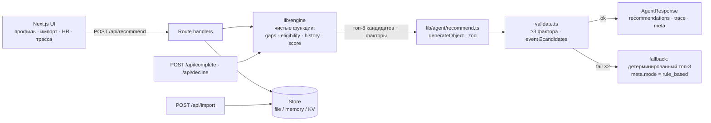

# Career Quest (Halyk, кейс 1) — спецификация на 100 %

Документ для трёх людей и одного Codex. Читать сверху вниз: сначала «зачем», потом «что именно сдаём», потом «как строим по часам». Всё, что в таблицах «Проверка», — это то, что жюри реально сделает на защите.

---

## 0. Одной строкой

**Строка демо:** сотрудник открывает свой профиль → видит навыки против требований следующего грейда → нажимает «Что мне делать дальше?» → агент за ≤ 8 с показывает 1–3 шага, у каждого 3+ фактора с цифрами, альтернативы «почему не это» и уверенность → сотрудник отмечает шаг выполненным → навыки и траектория сдвигаются → HR в своём экране видит, какие навыки проседают по компании и у кого нет следующего шага.

**Ключевое отличие от «взять минимальный навык»:** движок считает разрыв до *следующего грейда* с весом критичности, штрафует форматы, которые сотрудник трижды пропускал, а LLM принимает решение среди топ-кандидатов и обязана сослаться минимум на три разных фактора. Валидатор это проверяет; если LLM не справилась — честный детерминированный запасной путь с пометкой.

**Killer feature (§6.10, §17):** планировщик «Путь к следующему грейду» — детерминированная последовательность событий, закрывающая *все* разрывы до грейда, с дорожной картой по месяцам. Каждая рекомендация получает фактор «шаг 1 из 3 к Senior; без него переход сдвигается на ~4 месяца». Побочный продукт для HR: навыки, которые ни одно событие каталога не развивает до нужного уровня, и события, лежащие на наибольшем числе критических путей — куда реально направлять бюджет.

---

## 1. Почему кейс 4, а не кейс 12 — аргументы для команды

### 1.1 За

| # | Аргумент | Откуда |
|---|---|---|
| 1 | **Отдельный зачёт Halyk.** ТЗ прямо: «Зачёты раздельные, команды с разными кейсами между собой не сравниваются». Мы соревнуемся только с теми, кто взял Career Quest. У кейса 12 статус призового пула неизвестен, а «‑lite» в названии = стартовый уровень = толпа. | ТЗ Halyk, п. 4 |
| 2 | **Ценность (15) и потенциал (10) уже зашиты.** Крупнейший банк страны, реальная боль: бюджет на развитие тратится полностью, завершаемость низкая. Цифры для README берутся из самого ТЗ, не выдумываются. У кейса 12 «ценность в тенге» — натяжка про 66 профилей. | ТЗ, п. 2 |
| 3 | **Есть честный приёмочный тест.** Три одинаковых для всех «ловушечных» профиля. Большинство команд сделает «рекомендуй самый слабый навык» и промахнётся. Наш движок построен так, чтобы этот тест проходить по конструкции (разбор в §6.6). Это измеримое преимущество, а не «у нас красивее». | ТЗ, п. 7 |
| 4 | **Стек совпадает 1:1.** Next.js + Vercel AI SDK + `generateObject` + zod + панель трассы. Ни строчки Python. Плейбук команды (агент + инструменты + трасса + живая ссылка + README) ложится без изгибов. | osman.md / rauan.md |
| 5 | **Схема данных известна до выдачи кита.** В ТЗ есть пример JSON и состав всех 4 файлов. Строим на синтетике в той же схеме с 13:15, кит подставляем через один файл-адаптер. Риск «данные день-в-день» сводится к 20 минутам правки маппинга. | ТЗ, п. 5–6 |
| 6 | **Техническая реализация (25) — сильная история.** Детерминированный скоринг + LLM в точке решения + валидатор факторов + трасса. Это «agentic AI», который жюри может проверить. Кейс 12 = фильтр по 66 строкам + LLM пишет предложение; технический судья видит SQL с рассказчиком. | рубрика |
| 7 | **Оригинальность (10) есть где взять.** Петля «Не сейчас» (отказ с причиной → следующая рекомендация адаптируется), явная неуверенность модели, HR-теплокарта разрывов. Всё дёшево, всё в духе ТЗ («AI помогает человеку, не подменяет»). | ТЗ, п. 5–7 общих требований |
| 8 | **Роли в команде совпадают с планом.** Осман: API + агентный конвейер + деплой. Рауан: zod-контракт + движок скоринга + store + fallback + eval. Нурдаулет: синтетика + 4 экрана + трасса + README. Ничего не переучиваем. | планы 13:00–18:00 |

### 1.2 Против — честно, с ответом

| Риск | Чем страшен | Что делаем |
|---|---|---|
| Кит выдают в 13:00, формат полей неизвестен | Парсер ломается, час улетает | Один файл `lib/data/adapter.ts` с маппингом полей. Всё остальное работает с нашими внутренними типами. Синтетика в схеме ТЗ готова к 13:45, кит подключаем за 20 мин |
| 4 экрана вместо одного | Не успеть | Экраны — это списки и карточки без сложной логики. Codex генерит их за 10–15 мин каждый. Приоритет: профиль → импорт → HR → список |
| ≤ 10 с на рекомендацию | LLM тормозит | Всё, что считается, считается в коде (< 100 мс). LLM получает 8 готовых кандидатов и делает один `generateObject` на быстрой модели (2–4 с). Таймаут 8 с → детерминированный fallback с пометкой |
| Состояние «отметить выполненным» на Vercel | Serverless без диска | Абстракция `Store`: файл локально, память на Vercel (сброс на холодном старте честно указан), Upstash Redis если успеем — 10 минут |
| Ловушечные профили жюри | Провал на защите | Три собственных ловушечных профиля в `data/test-profiles/` с 13:45, `scripts/eval.ts` гоняет их на каждом коммите |
| Соблазн сделать геймификацию | Съест время, не в обязательной части | Won't. В README — «Потенциал развития» |

---

## 2. Как зарабатываем баллы — карта рубрики

| Критерий | Баллы | Чем закрываем |
|---|---|---|
| Соответствие задаче и работоспособность | 25 | Все 5 must-have работают на живой ссылке и локально одной командой. Импорт профилей жюри работает. Ловушечные профили проходят |
| Техническая реализация | 25 | Движок скоринга (чистые функции) → LLM-решение (`generateObject`, схема) → валидатор (≥ 3 фактора, событие из кандидатов) → fallback. Панель трассы показывает каждый шаг. Код совпадает с описанием в README |
| README и воспроизводимость | 25 | Заголовки README зеркалят рубрику. Каждое утверждение — путь к файлу. `npm i && npm run dev` или `docker compose up`. `.env.example`. Скриншоты, лог прогона, метрики из eval |
| Ценность и применимость | 15 | Проблема из ТЗ + оценка эффекта (завершаемость, явка) с пометкой «оценка команды». HR-экран = готовый инструмент для L&D |
| Потенциал и оригинальность | 10 | Петля отказов, неуверенность модели, границы применимости, дорожная карта (интеграция с календарём, прогноз оттока, геймификация) |

---

## 3. Definition of Done — must-have → реализация → проверка

| # | Must-have (ТЗ) | Реализация | Проверка на защите | Файлы |
|---|---|---|---|---|
| 1 | Профиль и карьерная траектория | `/employee/[id]`: роль, грейд, стаж, навыки (текущий vs требуемый для след. грейда), пройденные активности, доступные шаги | Открыть любого из 200 — всё видно. Открыть импортированного — тоже | `app/employee/[id]/page.tsx`, `components/SkillTable.tsx`, `components/Timeline.tsx` |
| 2 | AI-рекомендация следующего шага | `POST /api/recommend` → 1–3 события | Нажать кнопку — приходят 1–3 карточки за ≤ 10 с | `app/api/recommend/route.ts`, `lib/agent/recommend.ts` |
| 3 | Объяснение рекомендации (≥ 3 фактора) | Схема ответа требует `factors[]` с типами из enum {grade, skill_gap, next_grade_requirement, history, tenure}; валидатор отбрасывает ответ с < 3 разных типов | В карточке видны 3+ фактора с цифрами («System Design 2 при требуемых 4», «пропущено 3 из 3 speaking-активностей») | `lib/agent/schema.ts`, `lib/agent/validate.ts` |
| 4 | Обновление прогресса | `POST /api/complete` применяет `gain` до `max_level`, пишет в историю, пересчитывает разрывы и рекомендации | Отметить выполненным — уровень навыка вырос, разрыв уменьшился, рекомендация сменилась | `app/api/complete/route.ts`, `lib/engine/apply.ts` |
| 5 | Простой HR-view | `/hr`: топ проседающих навыков (кол-во сотрудников с разрывом), сотрудники без рекомендации и причина, участие по активностям (completed/skipped/refused) | Открыть `/hr` — три блока с данными | `app/hr/page.tsx`, `lib/engine/hrStats.ts` |
| 6 | Загрузка проверочных профилей | `/import`: загрузить `employees.json` (+ `activity_history.csv`), zod-валидация, отчёт, ссылки на импортированных | Жюри загружает свои 3 профиля — они открываются и получают рекомендации | `app/import/page.tsx`, `app/api/import/route.ts` |
| 7 | Разделение ролей сотрудник / HR | Переключатель роли → cookie; `/hr` без cookie `role=hr` редиректит; сотрудник видит только себя | Без роли HR `/hr` недоступен | `middleware.ts`, `components/RoleSwitch.tsx` |
| 8 | Запуск одной командой | `npm run dev` / `docker compose up`; данные подхватываются из `data/` | Чистая машина, README, работает | `README.md`, `docker-compose.yml` |
| 9 | Explainability + неуверенность | Панель «Как агент решал»: каждый инструмент с входом/выходом/мс; `confidence` и `caveats` в карточке | Жюри видит логику, не вердикт | `components/TracePanel.tsx` |
| 10 | Добровольность | Кнопка «Не сейчас» с причиной → запись `refused` → пересчёт. Нет публичных рейтингов | Нажать «Не сейчас» — следующая рекомендация другая | `app/api/decline/route.ts` |
| 11 | **Should — путь к грейду** (опция ТЗ «моделирование перехода на грейд») | Планировщик §6.10: дорожная карта, месяцы, `unclosable`; фактор `path` в рекомендации; HR-блоки «дефекты каталога» и «события на критических путях» | На профиле T001 видна карта из 2–3 шагов к Senior; в `/hr` — навык, который каталог не закрывает | `lib/engine/plan.ts`, `components/PathRoadmap.tsx` |

Запрещено (ТЗ): рекомендация по одному полю; публичные рейтинги; механика вокруг обязательных процессов; реальные ПДн; хардкод проверочных профилей.

---

## 4. Данные

### 4.1 Файлы кита (из ТЗ) и наши внутренние типы

| Файл кита | Что внутри (ТЗ) | Внутренний тип |
|---|---|---|
| `employees.json` | 200 профилей: роль, грейд, стаж, навыки 0–5 | `Employee` |
| `events.json` | 40 событий: тип, аудитория, развиваемые навыки (gain, max_level) | `Event` |
| `activity_history.csv` | 24 мес. участия, включая пропуски и отказы | `HistoryRecord` |
| `skills.json` | 60 навыков hard/soft, требования по грейдам | `Skill` |

Данные на английском + переводы kk/ru. Адаптер берёт `name_ru`, fallback `name`.

### 4.2 zod-схемы (`lib/types.ts`) — пишем до кита, правим только адаптер

```ts
import { z } from "zod";

export const Grade = z.enum(["Junior", "Middle", "Senior", "Lead"]); // уточнить по skills.json
export type Grade = z.infer<typeof Grade>;

export const Employee = z.object({
  employee_id: z.string(),
  role: z.string(),
  grade: Grade,
  tenure_months: z.number().int().nonnegative(),
  skills: z.record(z.string(), z.number().int().min(0).max(5)),
  name: z.string().optional(), // синтетическое, не ПДн
});

export const Skill = z.object({
  skill_id: z.string(),
  name: z.string(),
  kind: z.enum(["hard", "soft"]),
  requirements: z.record(Grade, z.number().int().min(0).max(5)), // уровень, требуемый на грейде
  critical_for: z.array(Grade).default([]), // если в ките есть; иначе выводим: req[g+1] - req[g] >= 2
});

export const Event = z.object({
  event_id: z.string(),
  name: z.string(),
  type: z.string(), // training | mentoring | rotation | certification | club | conference | ...
  audience: z.object({
    roles: z.array(z.string()).default([]),  // пусто = все
    grades: z.array(Grade).default([]),      // пусто = все
  }),
  develops: z.array(z.object({
    skill_id: z.string(),
    gain: z.number().int().min(1).max(5),
    max_level: z.number().int().min(1).max(5),
  })),
  repeatable: z.boolean().default(false),
  duration_hours: z.number().optional(),
});

export const HistoryStatus = z.enum(["completed", "skipped", "refused", "registered"]);
export const HistoryRecord = z.object({
  employee_id: z.string(),
  event_id: z.string(),
  month: z.string(), // YYYY-MM
  status: HistoryStatus,
  on_time: z.boolean().optional(),
});

export const Dataset = z.object({
  employees: z.array(Employee),
  skills: z.array(Skill),
  events: z.array(Event),
  history: z.array(HistoryRecord),
});
```

### 4.3 Адаптер (`lib/data/adapter.ts`) — единственное место, где живут имена полей кита

```ts
// Правило: сырой кит → внутренние типы. Все переименования и нормализации здесь.
// Пример: kit "declined" -> "refused"; kit "level_required" -> requirements; name_ru -> name.
export function normalizeDataset(raw: RawKit): Dataset { ... }
```

Когда кит выдадут: Рауан открывает файлы, за 20 минут правит только `adapter.ts` и `Grade`. Тесты `scripts/try-engine.ts` должны проходить на ките как на синтетике.

### 4.4 Синтетика (Нурдаулет, 13:15–13:45, промпт Н-1 в §14)

- 200 сотрудников, 8 ролей (Backend, Frontend, QA, Data, Product, Analyst, Support, Manager), 4 грейда, стаж 6–120 мес., навыки 0–5.
- 60 навыков: 40 hard / 20 soft, требования растут по грейдам, 1–2 «критичных» на переход.
- 40 событий разных типов, у каждого 1–3 развиваемых навыка с `gain` 1–2 и `max_level` 3–5.
- 24 месяца истории: 60 % completed, 25 % skipped, 15 % refused; у части сотрудников выраженное избегание одного типа.
- Имена — вымышленные, не ПДн.

### 4.5 Три ловушечных профиля (`data/test-profiles/`) — обязательны с 13:45

| ID | Ловушка | Однофакторное правило | Правильный ответ |
|---|---|---|---|
| T001 | Минимальный навык Public Speaking (2/3), но 3 пропуска speaking-активностей; для Senior критичен System Design (2/4) | «Бери минимальный» → Public Speaking | System Design workshop; Public Speaking упомянуть как фактор, предложить мягкий формат как опцию |
| T002 | Все навыки ≥ требований следующего грейда, кроме одного soft-навыка с gap 1; стаж в грейде 40 мес. | «Всё хорошо, нечего рекомендовать» | Закрыть последний разрыв + событие на подготовку к переходу; фактор стаж |
| T003 | Два навыка с одинаковым разрывом 2; один развивается событием, которое сотрудник уже проходил (не repeatable), второй — доступным событием | «Бери первый по алфавиту» | Второй навык; фактор история («уже пройдено, повтор не даёт gain») |

Промпт для генерации ловушек — Н-1b в §14. **Хардкодить ответы на них запрещено** — они только в eval.

---

## 5. Архитектура



**Принцип:** цифры считает код, решение принимает LLM среди подготовленных кандидатов, валидатор не даёт LLM выйти за данные. Это одновременно «LLM в точке содержательного решения» (требование ТЗ) и «не чёрный ящик» (требование ТЗ).

**Конвейер фиксированный, не свободный цикл.** Шаги: `loadProfile → computeGaps → summarizeHistory → listEligible → scoreCandidates → llmDecide → validate → (fallback)`. Каждый шаг пишет `TraceItem {tool, input, output, ms}`. Надёжнее свободного tool-calling, укладывается в ≤ 10 с, и всё равно агентно: трасса показывает инструменты и решение.

### 5.1 Store (`lib/store/`)

```ts
export interface Store {
  getDataset(): Promise<Dataset>;
  upsertEmployees(list: Employee[]): Promise<void>;
  appendHistory(records: HistoryRecord[]): Promise<void>;
  updateSkills(employee_id: string, skills: Record<string, number>): Promise<void>;
}
// FileStore  -> data/state.json (локально, docker)
// MemoryStore -> Vercel без KV (сброс на холодном старте — указать в README и бейджем в UI)
// KvStore    -> Upstash Redis, если UPSTASH_REDIS_REST_URL задан (опционально, 10 мин)
```

---

## 6. Движок рекомендаций — ядро

### 6.1 Обозначения

- `g` — текущий грейд, `g1` — следующий (по лестнице из `Grade`). Для Lead `g1 = null` → режим «развитие в грейде».
- `cur[s]` — текущий уровень навыка `s` (0–5). `req[s][g1]` — требуемый уровень на следующем грейде.
- `gap[s] = max(0, req[s][g1] − cur[s])`.

### 6.2 Критичность навыка

```
crit[s] = 2.0  если s ∈ critical_for[g1]  (или, если поля нет: req[s][g1] − req[s][g] ≥ 2)
        = 1.0  если req[s][g1] > 0
        = 0.3  иначе (навык не требуется на g1, но развивать можно)
```

### 6.3 Пригодность события

Событие `ev` пригодно для сотрудника, если:
1. `audience.roles` пуст или содержит роль; `audience.grades` пуст или содержит грейд.
2. Не пройдено ранее (`completed`), либо `repeatable = true`.
3. Существует навык в `develops`, где `cur[s] < max_level` (иначе gain = 0 — бессмысленно).

Причина непригодности сохраняется — она нужна HR-экрану («почему нет рекомендации»).

### 6.4 Скор

```
useful_gain[ev][s] = min(gain, max(0, max_level − cur[s]))
gap_closure[ev][s] = min(useful_gain, gap[s])
impact[ev] = Σ_s crit[s] · gap_closure[ev][s]  +  0.25 · Σ_s crit[s] · (useful_gain − gap_closure)

тип t = ev.type; по истории сотрудника за 24 мес.:
avoidance[t] = (skipped_t + refused_t) / max(1, completed_t + skipped_t + refused_t)
history_factor[ev] = max(0.4, 1 − 0.6 · avoidance[t])
avoided_format[ev] = (skipped_t + refused_t ≥ 3) ∧ (completed_t = 0)

urgency = 1.2 если tenure_months > медиана стажа по грейду в датасете, иначе 1.0

score[ev] = impact[ev] · history_factor[ev] · urgency
```

Выход `scoreCandidates`: топ-8 по `score`, у каждого полный разбор:

```ts
type Candidate = {
  event_id: string; name: string; type: string; score: number;
  impact: number; history_factor: number; urgency: number;
  gap_closure: { skill_id: string; from: number; to: number; required: number; critical: boolean }[];
  history: { type: string; completed: number; skipped: number; refused: number; avoided_format: boolean };
  eligibility: "ok";
};
```

### 6.5 Шаг LLM (`lib/agent/recommend.ts`)

Вход: краткий профиль, таблица требований g1 (только навыки с `gap > 0` или `crit ≥ 1`), сводка истории, 8 кандидатов с разбором, правила.

Схема ответа (`lib/agent/schema.ts`):

```ts
export const Factor = z.object({
  type: z.enum(["grade", "skill_gap", "next_grade_requirement", "history", "tenure", "path"]),
  evidence: z.string().min(10), // с цифрами из входа: «System Design 2 при требуемых 4 для Senior»
  // path: «шаг 1 из 3 на пути к Senior; без него переход сдвигается на ~4 месяца» (из §6.10)
});

export const Recommendation = z.object({
  event_id: z.string(),
  rank: z.number().int().min(1).max(3),
  rationale: z.string().min(40).max(400), // по-русски, обращение на «вы», без оценочных ярлыков
  factors: z.array(Factor).min(3),
  confidence: z.number().min(0).max(1),
  caveats: z.string().optional(), // где данных мало или модель не уверена
});

export const RecommendationSet = z.object({
  recommendations: z.array(Recommendation).min(1).max(3),
  alternatives_considered: z.array(z.object({ event_id: z.string(), why_not: z.string() })).max(3),
  note_for_employee: z.string().optional(), // мягкий тон, добровольность
});
```

Системный промпт (суть, полный текст в `lib/agent/prompt.ts`):

> Вы — карьерный советник. Вы выбираете 1–3 шага из списка кандидатов и объясняете выбор. Правила: (1) рекомендуйте только `event_id` из списка кандидатов; (2) каждая рекомендация опирается минимум на три разных типа факторов с конкретными цифрами из данных; (3) критичность навыка для следующего грейда важнее размера разрыва; (4) если формат активности сотрудник пропускал ≥ 3 раз и не завершал ни разу, не ставьте его первым — назовите это фактором и, если навык всё же важен, предложите другой формат как опцию; (5) не рекомендуйте «самый низкий навык» по умолчанию; (6) там, где данных мало, скажите об этом в `caveats` и снизьте `confidence`; (7) тон — поддерживающий, без сравнения с коллегами, решение остаётся за сотрудником.

Модель: быстрый класс из `process.env.MODEL` (gpt-4o-mini-класс), `temperature 0.2`, `maxTokens 900`, таймаут 8 с.

### 6.6 Валидатор и fallback (`lib/agent/validate.ts`)

Проверки: все `event_id` ∈ кандидаты; в каждой рекомендации ≥ 3 **разных** `type`; `evidence` содержит хотя бы одну цифру; ранги уникальны. Провал → один повтор с текстом ошибки. Второй провал или таймаут → `fallback`: топ-3 по `score` с шаблонными факторами из разбора (`gap_closure`, `history`, `tenure`), `meta.mode = "rule_based"`, в UI бейдж «Правило без LLM». Честно и всё ещё соответствует must-have 3.

### 6.7 Прогон ловушки T001 (почему движок проходит тест жюри)

Дано: Public Speaking `cur 2 / req 3`, crit 1.0; System Design `cur 2 / req 4`, crit 2.0 (критичен для Senior). История: speaking-активности skipped 3, completed 0.

| Кандидат | gap_closure | impact | history_factor | score |
|---|---|---|---|---|
| Public Speaking Club (gain 1) | PS 1 | 1 · 1.0 = 1.0 | avoidance 1.0 → 0.4, `avoided_format` | 0.40 |
| System Design Workshop (gain 1) | SD 1 | 1 · 2.0 = 2.0 | нейтрально 1.0 | 2.00 |
| Architecture Mentoring (gain 2) | SD 2 | 2 · 2.0 = 4.0 | нейтрально 1.0 | 4.00 |

LLM получает это и выдаёт: #1 Architecture Mentoring, #2 System Design Workshop, в `alternatives_considered` — Public Speaking Club с `why_not`: «пропущено 3 из 3, не завершено ни одно; навык нужен для Senior (2→3), предложим формат малой группы позже». Факторы: `next_grade_requirement` (SD 4 при 2), `skill_gap` (разрыв 2 — наибольший среди критичных), `history` (3 пропуска speaking), `grade` (Middle → Senior). Тест пройден без единой захардкоженной строки.

### 6.8 Применение прогресса (`lib/engine/apply.ts`)

```
для каждого s ∈ ev.develops: cur[s] = min(max_level, cur[s] + gain)
history += { employee_id, event_id, month: now, status: "completed", on_time: true }
пересчитать gaps, кандидатов, рекомендации → вернуть diff: { skill_id, from, to }[]
```

UI показывает diff анимацией «System Design 2 → 3» и новую рекомендацию.

### 6.9 HR-статистика (`lib/engine/hrStats.ts`)

- `saggingSkills`: для каждого навыка — число сотрудников с `gap ≥ 1` к своему g1, доля критичных; топ-10.
- `noRecommendation`: сотрудники, у которых нет пригодных событий, с причиной (все навыки на max / нет событий для роли-грейда / все доступные пройдены).
- `participationByEvent`: по событию — completed / skipped / refused за 24 мес., completion rate.

Никаких рейтингов людей. Только агрегаты по навыкам и событиям + список «без шага» как рабочий список для HR.

### 6.10 Killer feature — планировщик «Путь к следующему грейду» (`lib/engine/plan.ts`)

**Зачем.** Кейс называется «AI-навигатор», боль в ТЗ — «сотрудник не видит траектории». Рекомендация одного шага — это компас. Планировщик — это карта. «Моделирование перехода на грейд» прямо названо в ТЗ опциональным пунктом; жюри его ждёт как бонус, почти никто не успевает.

**Алгоритм (жадный, детерминированный, без LLM):**

```
вход: employee, g1, eligibleEvents (без пройденных non-repeatable), gaps, crit, history_factor
virtual = copy(cur); steps = []
пока есть s с gap_virtual[s] > 0:
  для каждого ev ∈ eligibleEvents \ использованные:
      value[ev] = Σ_s crit[s] · min(gain, max_level − virtual[s], gap_virtual[s]) · history_factor[ev]
  best = argmax value (tie-break: меньше событий в develops, затем event_id)
  если value[best] = 0 → break            // никакое событие не закрывает оставшиеся разрывы
  применить best к virtual (до max_level); steps.push({ event, diff, closes: [skill...] })
выход: { steps, months_estimate: steps.length · 1 (допущение: одно событие в месяц, указать в UI),
         unclosable: [{ skill_id, from: virtual[s], required: req[s][g1] }] }
```

`unclosable` — навыки, до требуемого уровня которых **ни одно событие каталога не дотягивает**. Это дефект каталога, а не сотрудника; в UI формулируется как «требуется событие, которого нет в каталоге», без упрёка.

**Как встраивается в рекомендацию.** Планировщик считается до `llmDecide`. Кандидатам, входящим в `steps`, добавляется поле `on_path: { step_index, delay_months_if_skipped }` (пересчёт плана без этого события). LLM получает это как шестой тип фактора `path`. Пример: «Architecture Mentoring — шаг 1 из 3 к Senior; без него переход сдвигается с ~3 до ~5 месяцев».

**UI сотрудника:** блок «Путь к Senior» под рекомендациями — горизонтальная дорожная карта: шаг → событие → какие навыки и на сколько → месяц; внизу «оценка: ~3 месяца при одном событии в месяц»; если есть `unclosable` — жёлтая плашка «System Design до 5 не развивает ни одно событие каталога — сообщено HR».

**HR-агрегаты (`hrStats.ts`, +15 строк):**
- **`catalogGaps`** — навыки из `unclosable` по всем сотрудникам: навык, требуемый уровень, сколько сотрудников упираются. Готовый список для «конструктора событий» HR (опция из ТЗ) — мы не строим конструктор, мы говорим, что именно в нём создать.
- **`eventsOnCriticalPaths`** — события, лежащие на наибольшем числе путей: «System Design Workshop закрывает критический разрыв у 37 сотрудников». Ответ на вопрос из ТЗ «бюджет израсходован, а завершаемость низкая»: куда направить бюджет, чтобы сдвинулось больше всего переходов.

Никаких рейтингов людей: агрегаты только по навыкам и событиям.

**Стоимость:** планировщик 40 мин (Рауан, чистые функции), включение в `AgentResponse` 15 мин (Осман), дорожная карта 30 мин (Нурдаулет), HR-блоки 15 мин. Ложится в 15:15–16:45 при зелёной контрольной точке B.

**Цена ошибки:** нулевая для must-have — планировщик отключается флагом `ENABLE_PLANNER`; рекомендации без фактора `path` всё равно проходят валидатор (≥ 3 из остальных пяти типов).

---

## 7. Экраны (весь UI на русском)

| Маршрут | Роль | Содержимое |
|---|---|---|
| `/` | обе | Список сотрудников (поиск, фильтр роль/грейд), кнопки «Импорт», «HR-экран», переключатель роли. Три кнопки-примера: «Обычный профиль», «Ловушка T001», «Импортированный» |
| `/employee/[id]` | сотрудник (свой) / HR (любой) | Шапка: роль, грейд → следующий грейд, стаж. Таблица навыков: текущий / требуется на g1 / разрыв, критичные помечены. Лента активностей (completed / skipped / refused). Блок «Следующий шаг»: кнопка → 1–3 карточки (название, зачем, факторы, уверенность, caveats), кнопки «Выполнено» и «Не сейчас». **Блок «Путь к <g1>»**: дорожная карта из §6.10, оценка в месяцах, плашка `unclosable`. Свёрнутая панель «Как агент решал» |
| `/hr` | HR | Три блока из §6.9 + два из §6.10 (дефекты каталога, события на критических путях). Клик по сотруднику из «без шага» → его профиль |
| `/import` | HR | Drag-and-drop `employees.json` (+ `activity_history.csv`), отчёт валидации (принято / ошибки по строкам), ссылки на импортированных |

Тексты интерфейса короткие, судье понятны без разработчика. Мобильная вёрстка — проверить с телефона в 15:40 (план Нурдаулета).

---

## 8. Контракты API (`lib/types.ts`, экспорт для фронта)

```ts
// POST /api/recommend  { employee_id }
export const AgentResponse = z.object({
  employee_id: z.string(),
  next_grade: Grade.nullable(),
  result: RecommendationSet,
  candidates: z.array(CandidateSchema), // для панели трассы и «почему не это»
  path: z.object({                       // §6.10; null если ENABLE_PLANNER=false или g1 = null
    steps: z.array(z.object({ event_id: z.string(), name: z.string(), month: z.number().int(),
      diff: z.array(z.object({ skill_id: z.string(), from: z.number(), to: z.number() })) })),
    months_estimate: z.number().int(),
    unclosable: z.array(z.object({ skill_id: z.string(), from: z.number(), required: z.number() })),
  }).nullable(),
  trace: z.array(z.object({ tool: z.string(), input: z.unknown(), output: z.unknown(), ms: z.number() })),
  meta: z.object({
    mode: z.enum(["live", "fallback_provider", "rule_based", "demo"]),
    model: z.string(), steps: z.number(), tokens: z.number().optional(), costUsd: z.number().optional(), latencyMs: z.number(),
  }),
});

// POST /api/complete  { employee_id, event_id } -> { diff: {skill_id, from, to}[], next: AgentResponse }
// POST /api/decline   { employee_id, event_id, reason?: string } -> { next: AgentResponse }
// POST /api/import    multipart: employees (json), history? (csv) -> { imported: string[], errors: {row, message}[] }
// GET  /api/hr        -> { saggingSkills, noRecommendation, participationByEvent }
```

Ошибки: `{ error: { code, message_ru } }`, HTTP 400/422/500. Все входы валидируются zod.

---

## 9. Ограничения ТЗ → как соблюдаем

| Требование | Реализация |
|---|---|
| Приватность: вовлечённость не видна другим сотрудникам | Сотрудник видит только `/employee/[свой id]`; агрегаты HR без ФИО-подобных полей в рейтинге |
| Безопасность: сотрудник / HR | Cookie `role`; `middleware.ts` закрывает `/hr`, `/import`, `GET /api/hr`. В README: в проде — SSO/RBAC |
| Explainability | Факторы с цифрами, `alternatives_considered`, панель трассы, `confidence`, `caveats` |
| Запуск одной командой | `npm run dev` / `docker compose up`, данные из `data/` |
| Добровольность | «Не сейчас» без санкций, тон рекомендаций, отсутствие рейтингов |
| AI не единственный источник истины | `rule_based` fallback виден; решение принимает человек |
| Нет хардкода проверочных профилей | Ловушки только в `scripts/eval.ts`; в коде движка нет `employee_id` |
| Нет реальных ПДн | Синтетика, имена вымышленные, кит обезличен |

---

## 10. План по часам (лок в 13:15)

| Время | Осман (API, агент, деплой) | Рауан (типы, движок, store, fallback, eval) | Нурдаулет (данные, UI, README) |
|---|---|---|---|
| 13:00–13:15 | Вопросы организаторам (см. §16), открыть кит если уже выдан | Быстрый просмотр кита: имена полей → заметки для адаптера | Прочитать ТЗ Career Quest ещё раз, выписать 5 must-have в README-скелет |
| 13:15–13:45 | Codex О-1: каркас Next.js, `/api/recommend` мок по контракту, деплой Vercel, ссылка в чат | Codex Р-1: `lib/types.ts`, `lib/data/adapter.ts`, `lib/store/*`, загрузка `data/` | Codex Н-1 + Н-1b: синтетика 200/60/40/24 мес. + 3 ловушки → `data/` |
| 13:45–14:30 | Codex О-2: конвейер `recommend.ts` + `schema.ts` + `prompt.ts` + `validate.ts`, `generateObject`, таймаут | Codex Р-2: `lib/engine/*` (gaps, eligibility, history, score, apply, hrStats), `scripts/try-engine.ts` на T001–T003 | Codex Н-2: `/` список + `/employee/[id]` профиль на данных store (без рекомендаций пока) |
| **14:40** | **Контрольная точка A:** один реальный прогон T001 на живой ссылке даёт System Design, не Public Speaking | | |
| 14:30–15:15 | `/api/complete`, `/api/decline`; подключить fallback Рауана | **Кит подставить** (адаптер, 20 мин) → `try-engine` зелёный на ките. Codex Р-3: fallback OpenAI → NVIDIA → `rule_based` | Codex Н-3: блок «Следующий шаг» с карточками + кнопки + `TracePanel` |
| 15:15–16:00 | `/api/import` (zod-отчёт), `/api/hr`, `middleware.ts` роли | Codex Р-5: `lib/engine/plan.ts` (§6.10) + `try-engine` печатает путь для T001; `catalogGaps`, `eventsOnCriticalPaths` в `hrStats.ts` | Codex Н-4: `/import`, `/hr`, `RoleSwitch` |
| **16:00** | **Контрольная точка B:** 3/3 сценария на живой ссылке: обычный профиль → рекомендация → выполнено → сдвиг; T001 корректен; импорт файла → профиль открывается. **B не пройдена → планировщик выключаем флагом, час уходит на надёжность** | | |
| 16:00–16:45 | Codex О-4: `path` в `AgentResponse`, `on_path` в кандидатах, фактор `path` в промпте; HR-блоки в `/api/hr`; `maxDuration`, env на Vercel | Codex Р-4: `scripts/eval.ts` — 10 сотрудников + 3 ловушки: факторы ≥ 3, event ∈ candidates, T001/T003 pass, латентность, cost, mode → `docs/metrics.md` | Codex Н-5: `components/PathRoadmap.tsx` + два HR-блока; затем скриншоты `docs/screenshots/` |
| 16:45–17:00 | Should-2 (если всё зелёное): петля «Не сейчас» влияет на следующую рекомендацию | Фиксы из баг-листа Нурдаулета | Тест с телефона по мобильному интернету, баг-лист, лог прогона `docs/sample-run.log` |
| **17:00** | **Фриз фич.** Только багфиксы | | |
| 17:00–17:45 | Ревью README против кода; финальный деплой; инкогнито | Проверка путей в README скриптом; проверка `rule_based` на preview с неверным ключом | README по Промпту 2 v2; видео 2–3 мин; «сценарий для судьи» на 60 с в README |
| 17:45–17:55 | Последние коммиты у всех | | |

**Что режем первым (если горит):** петля «Не сейчас» → HR-блок «события на критических путях» (оставить `catalogGaps`) → дорожная карта как график (оставить текстовый список шагов) → график участия в HR (оставить таблицу) → CSV-импорт истории (оставить JSON профилей) → Upstash (оставить память с бейджем) → **последним** планировщик целиком (флаг `ENABLE_PLANNER=false`). **Не режем никогда:** живая ссылка, рекомендация с ≥ 3 факторами, «Выполнено» со сдвигом, импорт профилей, HR-экран, трасса.

Коммиты — минимум раз в час у каждого, `git pull --rebase`, без `--force`, `git add` только своих файлов.

---

## 11. Владение файлами

| Осман | Рауан | Нурдаулет |
|---|---|---|
| `app/api/**`, `lib/agent/**`, `middleware.ts`, `package.json` + lock, Vercel | `AGENTS.md`, `lib/types.ts`, `lib/data/**`, `lib/store/**`, `lib/engine/**`, `lib/fallback/**`, `scripts/**`, `docs/metrics.md` | `data/**` (кроме `data/demo-cache/`), `app/page.tsx`, `app/employee/**`, `app/hr/**`, `app/import/**`, `components/**`, `README.md`, `docs/**` (кроме metrics) |

---

## 12. Eval (`scripts/eval.ts`) — цифры для README

Для 10 случайных сотрудников + T001–T003:
- рекомендации 1–3, у каждой ≥ 3 разных типа факторов — pass/fail;
- каждый `event_id` пригоден (audience, не пройден, gain > 0) — pass/fail;
- T001: первый `event_id` развивает System Design, Public Speaking не первый — pass/fail;
- T003: не рекомендовано непригодное повторное событие — pass/fail;
- латентность p50/p95, tokens, costUsd, `meta.mode`.

Итог в `docs/metrics.md` таблицей. Это реальные цифры для раздела «Техническая реализация» README, не оценки.

---

## 13. Скелет README (заголовки зеркалят рубрику)

```
# Career Quest — AI-навигатор развития сотрудника (HackAlem AI · трек Halyk · кейс 1)
Живая ссылка · Видео 2 мин · Сценарий для судьи (60 секунд)

## 1. Проблема и ценность
## 2. Соответствие задаче и работоспособность — must-have → файл → как проверить
## 3. Техническая реализация — архитектура (Mermaid), движок скоринга (формулы), шаг LLM, валидатор, fallback, трасса
## 4. README и воспроизводимость — запуск одной командой, .env.example, данные, импорт профилей жюри
## 5. Ценность и применимость — эффект (пометка «оценка команды»), кто пользуется
## 6. Потенциал развития и оригинальность — петля отказов, неуверенность, дорожная карта
## 7. Метрики прогона (docs/metrics.md) и лог трассы
## 8. Ограничения и раскрытие — синтетика, память на Vercel, границы применимости, использование Codex
## 9. Команда и вклад
```

Правило: каждое «реализовано» → путь к файлу. Чего нет в коде — нет в README.

---

## 14. Промпты для Codex (копировать как есть)

**AGENTS.md (Рауан, 13:15) — положить в корень до первого промпта**

```
# AGENTS.md — Career Quest

WHAT: Next.js 15 (App Router) + TypeScript 5 + Tailwind + Vercel AI SDK (`ai`, `@ai-sdk/openai`) + zod. Deployed on Vercel. UI language: Russian.
WHY: HackAlem AI, Halyk track, case "Career Quest". Judges test 5 must-haves and 3 adversarial employee profiles. Rubric rewards: works, explainable agentic AI, README that matches code.

REPO MAP
- lib/types.ts            zod schemas: Employee, Skill, Event, HistoryRecord, Dataset, AgentResponse, RecommendationSet
- lib/data/adapter.ts     the ONLY place that knows raw kit field names -> internal types
- lib/store/              Store interface; FileStore (local), MemoryStore (Vercel), KvStore (optional)
- lib/engine/             pure functions, no LLM: gaps.ts, eligibility.ts, history.ts, score.ts, apply.ts, hrStats.ts
- lib/agent/              recommend.ts (pipeline), prompt.ts, schema.ts, validate.ts
- lib/fallback/           provider chain OpenAI -> NVIDIA -> rule_based
- app/api/{recommend,complete,decline,import,hr}/route.ts
- app/, components/       UI (Russian)
- data/                   dataset (synthetic until kit), data/test-profiles/ (T001-T003), data/demo-cache/
- scripts/                try-engine.ts, eval.ts

RULES
1. All arithmetic, filtering, sorting, eligibility happen in lib/engine (pure TS). The LLM only chooses among prepared candidates and writes rationale.
2. LLM output is validated with zod + validate.ts: every recommendation cites >= 3 DISTINCT factor types from {grade, skill_gap, next_grade_requirement, history, tenure}, every event_id is in the candidate list, evidence strings contain numbers.
3. Never hardcode employee_ids, event_ids or test-profile answers anywhere except scripts/eval.ts.
4. No secrets in code. OPENAI_API_KEY, NVIDIA_API_KEY, NVIDIA_BASE_URL, MODEL, UPSTASH_* from process.env. Keep .env.example current.
5. Validate every API input with zod. Errors return { error: { code, message_ru } }.
6. Files > 200 lines with multiple responsibilities must be split. Server Components by default; 'use client' only in leaf components.
7. Never silently replace a live run with cached output; meta.mode must say "live" | "fallback_provider" | "rule_based" | "demo" and the UI shows a badge for anything but "live".
8. Do not build leaderboards or rankings of people. HR view shows aggregates by skill/event and a work list of employees with no recommendation.
9. Do not edit files outside your owner's area (see spec §11). If you need a change there, stop and say so.
10. Before finishing any task: `npm run build` passes, `npx tsx scripts/try-engine.ts` passes.
```

**О-1 · 13:15 · каркас**
> Создай Next.js (App Router, TypeScript, Tailwind) проект в корне. Страница `/` с заголовком «Career Quest» и заглушкой списка. `POST /api/recommend` возвращает статичный `AgentResponse` по схеме из `lib/types.ts` (если файла ещё нет — создай минимальную схему по разделу 8 спецификации `CASE4-CAREER-QUEST-SPEC.md`) с `meta.mode = "demo"`. Добавь `.env.example` с `OPENAI_API_KEY`, `NVIDIA_API_KEY`, `NVIDIA_BASE_URL`, `MODEL`, `CRITIC_MODEL`. `npm run build` должен проходить.

**Р-1 · 13:15 · типы, адаптер, store**
> По разделам 4 и 5.1 спецификации создай `lib/types.ts` (все zod-схемы), `lib/data/adapter.ts` с функцией `normalizeDataset(raw)` и заглушками маппинга, `lib/store/index.ts` с интерфейсом `Store` и реализациями `FileStore` (читает `data/*.json|csv`, пишет `data/state.json`) и `MemoryStore`. Выбор реализации — по `process.env.VERCEL`. Добавь `lib/data/load.ts`, который читает `data/` и возвращает `Dataset`. Никаких вызовов LLM.

**Н-1 · 13:15 · синтетика**
> Сгенерируй синтетический датасет в схеме из раздела 4.2 спецификации: `data/employees.json` (200 профилей, 8 ролей, грейды Junior/Middle/Senior/Lead, стаж 6–120 мес., навыки 0–5), `data/skills.json` (60 навыков, 40 hard / 20 soft, требования по грейдам, у 1–2 навыков на каждый переход `critical_for`), `data/events.json` (40 событий 6 типов, у каждого 1–3 развиваемых навыка с gain 1–2 и max_level 3–5, audience по ролям/грейдам), `data/activity_history.csv` (24 месяца, ~3000 строк, статусы completed 60 % / skipped 25 % / refused 15 %, у 20 % сотрудников выраженное избегание одного типа событий). Имена вымышленные. Названия на русском в поле `name`. Сделай это скриптом `scripts/gen-synthetic.ts`, чтобы можно было перегенерировать.

**Н-1b · 13:35 · ловушки**
> Создай `data/test-profiles/T001.json`, `T002.json`, `T003.json` и `data/test-profiles/history.csv` по таблице из раздела 4.5 спецификации. Для каждого профиля добавь в `data/test-profiles/expected.json` описание правильного ответа (какой навык должен быть в первой рекомендации, какой не должен быть первым). Эти файлы используются только `scripts/eval.ts`.

**Р-2 · 13:45 · движок**
> Реализуй `lib/engine/` строго по разделу 6 спецификации: `gaps.ts` (computeGaps), `eligibility.ts` (listEligible с причинами непригодности), `history.ts` (summarizeHistory: по типам событий completed/skipped/refused, avoidance, avoided_format), `score.ts` (scoreCandidates → топ-8 `Candidate` с полным разбором), `apply.ts` (applyCompletion → diff), `hrStats.ts`. Только чистые функции над `Dataset`. Добавь `scripts/try-engine.ts`: прогоняет T001–T003 и печатает топ-3 кандидатов с разбором; для T001 первым должен быть кандидат, развивающий System Design.

**О-2 · 13:45 · агентный конвейер**
> Сначала опиши план: шаги конвейера, где могут упасть, как считается трасса. Потом реализуй `lib/agent/recommend.ts`: фиксированный конвейер loadProfile → computeGaps → summarizeHistory → listEligible → scoreCandidates → llmDecide → validate → fallback, каждый шаг пишет `TraceItem {tool, input, output, ms}`. `llmDecide` — `generateObject` с моделью из `process.env.MODEL`, схемой `RecommendationSet` из `lib/agent/schema.ts` (раздел 6.5), системным промптом из `lib/agent/prompt.ts` (раздел 6.5), таймаут 8 с. `validate.ts` по разделу 6.6, один повтор с текстом ошибки, затем `rule_based` fallback. Роут `POST /api/recommend` возвращает `AgentResponse`. Посчитай tokens и costUsd.

**Н-2 · 13:45 · список и профиль**
> В `app/page.tsx` и `app/employee/[id]/page.tsx` + `components/` сделай экраны по разделу 7 спецификации, читая данные через `Store` из `lib/store`. Таблица навыков: текущий / требуется на следующем грейде / разрыв, критичные выделены. Лента активностей с статусами. Блок «Следующий шаг» пока с кнопкой и пустым состоянием. Tailwind, русский язык, хорошо на телефоне. Не трогай файлы вне `app/page.tsx`, `app/employee/**`, `components/**`.

**Н-3 · 14:30 · карточки и трасса**
> В блоке «Следующий шаг» вызывай `POST /api/recommend`, показывай индикатор «Агент думает…», затем 1–3 карточки `Recommendation`: название события, `rationale`, список `factors` (тип → человекочитаемая метка на русском + evidence), `confidence` как полоску, `caveats`, кнопки «Выполнено» (`POST /api/complete`) и «Не сейчас» (`POST /api/decline`). После «Выполнено» покажи diff навыков анимацией и новую рекомендацию. Блок «Почему не другие» из `alternatives_considered`. Компонент `components/TracePanel.tsx`: «Как агент решал», нумерованные шаги из `trace` с input/output (свёрнуты) и мс. Бейдж режима, если `meta.mode !== "live"`.

**Р-3 · 14:30 · страховка**
> В `lib/fallback/` сделай обёртку вызова модели: OpenAI → при ошибке/429 NVIDIA (OpenAI-совместимый клиент, `NVIDIA_BASE_URL`, `NVIDIA_API_KEY`) → при ошибке вернуть маркер, по которому `recommend.ts` уходит в `rule_based`. Режим пиши в `meta.mode`. Скрипт, который прогоняет три кнопки-примера и сохраняет ответы в `data/demo-cache/` с `meta.mode = "demo"` — используется только если и провайдеры, и `rule_based` недоступны (практически никогда).

**О-3 · 15:15 · импорт, HR, роли**
> `POST /api/import`: принимает multipart (`employees` JSON, опционально `history` CSV), валидирует zod, нормализует через `adapter.ts`, апсертит в `Store`, возвращает `{ imported, errors }`. `GET /api/hr` возвращает `hrStats`. `middleware.ts`: cookie `role`; без `role=hr` редирект с `/hr`, `/import` и 403 на `/api/hr`, `/api/import`.

**Н-4 · 15:15 · импорт и HR-экран**
> `app/import/page.tsx`: drag-and-drop файлов, отчёт валидации (принято N, ошибки по строкам), ссылки на импортированных сотрудников. `app/hr/page.tsx`: три блока по разделу 6.9 — таблица проседающих навыков, список «без рекомендованного шага» с причиной и ссылкой на профиль, таблица участия по событиям. `components/RoleSwitch.tsx`: выбор «Сотрудник <id>» / «HR», пишет cookie `role` и `employee_id`.

**Р-4 · 15:15 · eval**
> Создай `scripts/eval.ts` по разделу 12 спецификации: URL из env (по умолчанию живая ссылка), 10 случайных сотрудников + T001–T003 (после их импорта через `/api/import`), проверки pass/fail, латентность p50/p95, tokens, costUsd, mode. Итог — таблица в `docs/metrics.md`.

**Code Detective · если ломается без ошибки**
> Ожидаемое поведение: <X>. Фактическое: <Y>. Ошибок нет. Вот код: <...>. Пройди функцию построчно, отслеживая значение каждой переменной, найди место, где логика расходится с ожиданием, объясни причину и дай исправленную версию.

---

## 15. Сценарий демо (90 секунд) и «сценарий для судьи» в README

1. (10 с) «Сотрудник видит десятки HR-событий и не понимает, зачем. Career Quest показывает траекторию и объясняет следующий шаг».
2. (20 с) Открыть T001: навыки vs Senior, три пропуска speaking-активностей в ленте. Нажать «Что дальше?».
3. (25 с) Карточка: Architecture Mentoring. Три фактора с цифрами. «Почему не Public Speaking» — пропуски. Уверенность. Раскрыть трассу на 3 секунды.
4. (15 с) «Выполнено» → System Design 2 → 3, разрыв 2 → 1, рекомендация сменилась.
5. (10 с) HR-экран: System Design проседает у 37 человек, 4 без шага.
6. (10 с) Импорт: перетащить файл жюри → профиль открылся → рекомендация.

Тот же список в README как «Сценарий для судьи (60 секунд)» с прямыми ссылками на T001 и `/hr` — на случай, если жюри открывает ссылку без нас.

---

## 16. Вопросы организаторам до 13:10 (Нурдаулет)

1. Кит Career Quest уже доступен? Где? (Если да — Рауан сразу смотрит поля.)
2. Защита — живая с жюри у нашего экрана, или жюри открывает ссылку самостоятельно? (Определяет, насколько подробен «сценарий для судьи».)
3. Проверочные профили жюри — в формате `employees.json` + `activity_history.csv` кита? Только профили или с историей? (Определяет, обязателен ли CSV-импорт истории в must-have.)

Если на вопрос 3 ответ «только профили без истории» — движок должен работать с пустой историей: `avoidance = 0`, фактор `history` формулируется как «истории участия нет, уверенность снижена», `confidence ≤ 0.6`. Это уже учтено в §6.5 п. 6.
