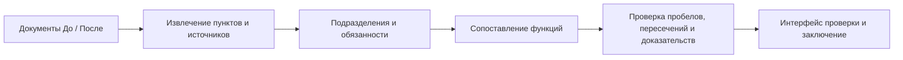

# Delphi — контроль функций при реорганизации

Анализ исходных документов, описание продукта и технический план на пятичасовой хакатон.

**Команда:** Осман — технический лидер; Нурдауалт — интерфейс и развёртывание; Рауан — тестирование, документация и презентация.

**Предлагаемый продукт:** веб-приложение, которое показывает изменения подразделений и обязанностей, выявляет возможные пробелы и пересечения ответственности и формирует заключение со ссылками на документы.

Главная особенность — **распознавать передачу функции другому подразделению и не объявлять её ошибочно потерянной**. В предоставленных документах есть реальный пример такой передачи.

Это описание предполагаемого MVP, а не отчёт о готовой реализации.

## 1. Исходные документы и границы анализа

| Документ | Содержание | Как используем |
|---|---|---|
| [Редакция 8](hackaton/tracks/Положение_о_внутреннем_аудите_редакция_8_обезличено.docx.md), утверждена 25 июня 2021 года | Прежняя структура, обязанности, полномочия и процедуры внутреннего аудита | Комплект «До» |
| [Редакция 9](hackaton/tracks/Положение_о_внутреннем_аудите_редакция_9_обезличено.docx.md), утверждена 23 декабря 2022 года | Расширенная структура, перераспределённые обязанности и изменённые формулировки | Комплект «После» |
| Обе редакции | Примерно по 10 000 слов, есть нумерованные пункты | Сопоставляем смысл, исполнителей и условия; сохраняем точные источники |

Это **две редакции одного положения о внутреннем аудите**, а не полный комплект документов компании. Содержимое упомянутого приложения с кодексом этики в экспортах отсутствует. Отдельного графического представления оргструктуры и положений обо всех подразделениях компании нет.

По контексту задачи владелец кейса — Казахтелеком, но сами образцы обезличены как **АО «Компания»** и содержат ссылки на российское законодательство. На защите следует говорить об анализе предоставленных образцов, а не о доказанных проблемах действующей структуры Казахтелекома.

## 2. Реальные изменения в документах

| Изменение | Где находится | Как должен объяснить продукт |
|---|---|---|
| **В перечне появились два подразделения** | Пункт 3.4: раньше ДНМ и ДККМ; теперь ДИТААД, ДОА, ДНМ и ДККМ | Два подразделения сохранены, два впервые указаны в новой редакции. Даты фактического создания неизвестны. |
| **Функция передана другому исполнителю** | Ред. 8, п. 5.4.4 → ред. 9, п. 5.3.3 | Работа с результатами других субъектов внутреннего контроля и выявление недостаточного/дублирующего покрытия рисков перешли от директора ДНМ к руководителям ДИТААД/ДОА. **Функция сохранилась.** |
| **Явно разделены направления аудита** | Ред. 9, п. 5.3.2 | ДИТААД — ИТ, информационная безопасность, данные и автоматизация аудита. ДОА — процессы развития, операционные и поддерживающие процессы. |
| **Изменилась обязательность действия** | Пункт 9.15 в обеих редакциях | «Осуществляется анализ» заменено на «может осуществляться анализ». Действие не исчезло, но формулировка стала допускающей выбор. |
| **Отдельные полномочия могли остаться без явного закрепления** | Ред. 8, п. 5.6.2–5.6.3; сопоставление с ред. 9, п. 5.6 | В старом перечне явно указаны формирование групп контроля качества и предложения по объёму внешней оценки. В новом общем перечне аналогичных явных полномочий нет. Это вопрос для проверки, а не доказательство исчезновения контроля качества. |
| **Возможна устаревшая внутренняя ссылка** | Ред. 9, п. 5.10.2 и 5.10.5 | Ссылки по-прежнему ведут на 5.8.1–5.8.2, но после перенумерации там находятся запреты; прежние права переместились в 5.7.1–5.7.2. Нужно проверить замысел автора. |

В этой паре документов лучше всего подтверждаются **изменения структуры, передача функций и изменение условий исполнения**. Явный новый конфликт интересов не следует придумывать ради демонстрации.

«Директор направления внутреннего аудита» в старой редакции — должность, а не название упразднённого департамента. Это различие должно сохраняться в модели данных и выводах.

## 3. Описание конечного продукта

Текст для README и питча:

> **Delphi сравнивает комплекты организационных документов до и после реорганизации, отслеживает передачу функций между подразделениями, выявляет потенциальные пробелы и пересечения ответственности и формирует проверяемое заключение со ссылками на исходные пункты.**

Пользовательский сценарий:

**Загрузить «До» и «После» → нажать «Анализировать» → проверить изменения и источники → получить заключение.**

В результатах достаточно трёх вкладок:

- **Структура** — какие подразделения сохранены, добавлены и изменены.
- **Функции и риски** — что произошло с обязанностями и какие вопросы требуют проверки.
- **Заключение** — итоговый отчёт для ответственного сотрудника.

## 4. Главные функции и приоритеты

| Функция | Что видит пользователь | Приоритет |
|---|---|---|
| **Загрузка комплектов** | Две области «До / После», определённые редакции, кнопка загрузки демонстрационного примера | Обязательно |
| **Сравнение подразделений** | Таблица подразделений и подчинённости с подтверждающими пунктами | Обязательно |
| **Карта передачи функций** | Старая функция → новый исполнитель и пункт; статусы: сохранена, переформулирована, передана, разделена, потенциально отсутствует | **Главная отличительная функция** |
| **Поиск пересечений и конфликтов** | Две сопоставленные обязанности, область действия и объяснение возможной проблемы | Обязательно |
| **Просмотр доказательств** | По нажатию на вывод открываются точные фрагменты старой и новой редакций | **Главная функция доверия** |
| **Аналитическое заключение** | Изменения, вопросы для проверки, ограничения анализа и экспорт | Обязательно |
| **Проверка внутренних ссылок** | Предупреждение, что смысл пункта назначения изменился после перенумерации | Дополнительно, если основа готова |

При поиске дублирования нужно сравнивать **действие + объект + область ответственности + роль исполнителя**.

Например, если два директора «готовят отчёты», это ещё не означает ошибочное дублирование. Аналогично, общая функция БВА и конкретная обязанность директора могут отражать нормальное распределение ответственности между уровнями управления.

Для потенциально потерянной функции корректная формулировка: **«Не найдено соответствие в предоставленном комплекте “После”»**. Утверждение о фактическом прекращении деятельности компании требует других доказательств.

## 5. Как должен работать агент

Для хакатона достаточно одного агента с небольшим набором инструментов:

| Инструмент | Назначение |
|---|---|
| `search_clauses(version, query)` | Найти возможное соответствие функции в другой части документа |
| `get_clause(clause_id)` | Получить точный текст пункта |
| `get_unit_functions(unit_id)` | Посмотреть обязанности подразделения |
| `check_references(document_id)` | Проверить внутренние ссылки |

Перед статусом **«потенциально отсутствует»** агент должен искать функцию во всём комплекте «После»: она могла сменить исполнителя, номер или формулировку.

**Модель выбирает существующие идентификаторы пунктов, а приложение подставляет цитаты из исходника.** Так проще исключить выдуманные ссылки. Проверка JSON-схемы подтверждает структуру ответа, но правильность интерпретации нужно проверять отдельно.

Сохраняйте текст источника, его редакцию, номер пункта и положение фрагмента в исходном тексте. Сопоставление должно допускать связь одной старой функции с несколькими новыми исполнителями или пунктами.

## 6. Рекомендуемый стек на пять часов

| Компонент | Технология | Зачем |
|---|---|---|
| **Интерфейс** | React + TypeScript + Vite | Таблицы сравнения, фильтры, вкладки и панель источников. Есть готовый шаблон React/TypeScript. [Документация](https://vite.dev/guide/). |
| **Backend** | Python + FastAPI + Pydantic | Обработка документов, схемы данных и инструменты агента в одном приложении. Собранный интерфейс можно отдавать через FastAPI. [Документация](https://fastapi.tiangolo.com/tutorial/static-files/). |
| **Чтение документов** | Markdown напрямую; `python-docx`, `pypdf`, `openpyxl` | Отдельные адаптеры DOCX, текстового PDF и XLSX, приводящие данные к единой структуре пунктов. [DOCX](https://python-docx.readthedocs.io/en/latest/), [PDF](https://pypdf.readthedocs.io/en/stable/user/extract-text.html), [XLSX](https://openpyxl.readthedocs.io/en/stable/tutorial.html). |
| **ИИ** | OpenAI Python SDK + Responses API | Структурированные результаты и вызовы инструментов. Одна настраиваемая модель, доступная в аккаунте с кредитами. [Structured Outputs](https://developers.openai.com/api/docs/guides/structured-outputs), [Function calling](https://developers.openai.com/api/docs/guides/function-calling). |
| **Хранение** | SQLite и постоянная папка загруженных файлов | Документы, пункты, результаты анализа и статусы проверки |
| **Экспорт** | HTML-отчёт с печатью в PDF; CSV-таблица функций | Простые и проверяемые результаты |
| **Развёртывание** | Один Docker-контейнер на знакомом команде хостинге | Один сервер, одна публичная ссылка и постоянное хранилище |

Начните с предоставленных Markdown-файлов, затем проверьте адаптеры на настоящих DOCX/PDF/XLSX. **Сканированные PDF требуют OCR** — `pypdf` самостоятельно его не выполняет. Не заявляйте поддержку формата, пока она не проверена на соответствующем файле.

## 7. Особенности парсинга этих файлов

- Несколько пунктов иногда склеены в одну строку: например, блоки раздела 3. Парсер только по началу строки пропустит часть пунктов.
- Разделы перенумерованы: номер сам по себе не определяет соответствие.
- Оглавление повторяет заголовки и не должно становиться набором новых функций.
- Буквенные подпункты должны сохранять родительский пункт и контекст ответственного исполнителя.
- В редакции 8 есть пустой пункт `5.5.3. ;` — его содержимое нельзя додумывать.
- Надёжных исходных номеров страниц нет: используйте редакцию, номер пункта и точный фрагмент. Номера страниц в оглавлении не заменяют проверенные ссылки на страницы.
- Для поиска нормализуйте пробелы и переносы, но исходный текст для доказательств храните отдельно.

## 8. План работы команды

| Время | Осман — технический лидер | Нурдауалт — интерфейс и деплой | Рауан — проверка и материалы |
|---|---|---|---|
| **Час 1** | Парсер пунктов, идентификаторы источников, схема результата | Загрузка файлов, каркас результатов, первый деплой | Разметить реальные изменения; составить проверки |
| **Час 2** | Извлечение подразделений и функций, сопоставление | Подключить анализ и отображение прогресса | Проверить структуру, передачу функций и ссылки |
| **Час 3** | Проверки пробелов/пересечений, валидация доказательств | Таблица сравнения и просмотр источников | Проверить перенумерацию, переформулировки и ложные совпадения |
| **Час 4** | Исправление ошибок; проверка ссылок, если основа стабильна | Заключение, экспорт, полировка основного сценария | README, скриншоты, запись демо |
| **Час 5** | Чистый запуск и проверка развёрнутой версии | Проверка с другого устройства | Репетиция, сдача и проверка отправленных ссылок |

## 9. Проверки перед демонстрацией

- [ ] ДНМ и ДККМ распознаны как сохранённые подразделения; ДИТААД и ДОА — как вновь указанные.
- [ ] Передача ред. 8 п. 5.4.4 → ред. 9 п. 5.3.3 распознана как передача функции, а не потеря.
- [ ] Перенумерация прав работников из раздела 5.8 в 5.7 не создаёт ложных исчезновений.
- [ ] Изменение обязательности в п. 9.15 показано с точным фрагментом.
- [ ] Каждый существенный вывод открывает существующие исходные пункты.
- [ ] Не найденные соответствия обозначены как потенциальные пробелы с границами анализа.
- [ ] Общие обязанности разных уровней управления не объявляются автоматически конфликтом.
- [ ] Интерфейс и экспорт содержат согласованные выводы и источники.
- [ ] Публичная ссылка и инструкция запуска проверены.

Чтобы показать обнаружение **действительно удалённой обязанности и намеренно созданного конфликта**, подготовьте отдельную небольшую синтетическую пару документов. Явно обозначьте её как контрольный пример и не смешивайте результаты с реальными находками.

## 10. Сценарий сильного демо

1. Загрузить предоставленные редакции 8 и 9.
2. Показать два новых подразделения и два сохранённых.
3. Открыть функцию, которую агент правильно распознал как переданную.
4. Показать изменение обязательности в п. 9.15.
5. Открыть подтверждающие фрагменты обеих редакций.
6. Сформировать аналитическое заключение.

**Основной акцент: каждое существенное изменение можно проверить по источнику, а каждая потенциально потерянная функция сначала проверяется на передачу другому исполнителю.**
