# Latest Delphi UI report

Generated: 2026-09-23T12:52:45.755Z  
Run: 2026-09-23T12-52-27-350Z-d7de39fc  
Result: **passed** · Duration: 18.4 seconds

Browser checks cover the local application. Each capture identifies its data source: live local backend data or explicitly mocked synthetic results. Synthetic results test UI interactions; they do not validate live AI analysis or translation quality. Authentication uses the local application. This report contains screenshots only, not session cookies, authentication state or traces.

## Test results

| Total | Passed | Failed | Flaky | Skipped | Not run |
|---|---|---|---|---|---|
| 10 | 10 | 0 | 0 | 0 | 0 |

## Pages and states

Each row is a captured state from this run. A screenshot can exist even when a later assertion in its test fails; the status records the test attempt that produced it.

| Page | Short description | Route | Viewport | Data source | Test status | Screenshot |
|---|---|---|---|---|---|---|
| Analysis · Structure | Before/after unit mappings link each structural change to its original source clauses. | /analyses/10000000-0000-4000-8000-000000000001?tab=structure | 1440 × 1000 | Synthetic API fixture; real frontend and authentication; no live AI | passed | [Open screenshot](screenshots/2026-09-23T12-52-27-350Z-d7de39fc/001-results-structure-desktop-chromium.png) |
| Analysis · Original source and parent context | The source panel keeps original Russian quotations, parent clauses and neighbouring-block navigation. | /analyses/10000000-0000-4000-8000-000000000001?tab=structure | 1440 × 1000 | Synthetic API fixture; real frontend and authentication; no live AI | passed | [Open screenshot](screenshots/2026-09-23T12-52-27-350Z-d7de39fc/002-results-source-context-desktop-chromium.png) |
| Analysis · Functions and risks | Searchable findings use shareable URL filters for change type, issues, review status and units. | /analyses/10000000-0000-4000-8000-000000000001?change=transferred | 1440 × 1000 | Synthetic API fixture; real frontend and authentication; no live AI | passed | [Open screenshot](screenshots/2026-09-23T12-52-27-350Z-d7de39fc/003-results-findings-filter-desktop-chromium.png) |
| Analysis · Finding evidence and human review | A deep-linked finding shows original before/after quotations and a separate human-review form. | /analyses/10000000-0000-4000-8000-000000000001?finding=70000000-0000-4000-8000-000000000001 | 1440 × 1000 | Synthetic API fixture; real frontend and authentication; no live AI | passed | [Open screenshot](screenshots/2026-09-23T12-52-27-350Z-d7de39fc/004-results-finding-evidence-desktop-chromium.png) |
| Analysis · Reviewed conclusion and exports | The report reflects the saved human review and stays available in its original language before translation. | /analyses/10000000-0000-4000-8000-000000000001?finding=70000000-0000-4000-8000-000000000001&tab=conclusion | 1440 × 1000 | Synthetic API fixture; real frontend and authentication; no live AI | passed | [Open screenshot](screenshots/2026-09-23T12-52-27-350Z-d7de39fc/005-results-reviewed-conclusion-desktop-chromium.png) |
| Analysis · Explicit saved-result translation | Translation is requested explicitly; translated reports preserve original source quotations and review revision. | /analyses/10000000-0000-4000-8000-000000000001?tab=conclusion | 1440 × 1000 | Synthetic API fixture; real frontend and authentication; no live AI | passed | [Open screenshot](screenshots/2026-09-23T12-52-27-350Z-d7de39fc/006-results-translated-conclusion-desktop-chromium.png) |
| Analysis · Running | An active run shows its current stage and coverage while polling for completion; unavailable findings are hidden. | /analyses/10000000-0000-4000-8000-000000000001 | 1440 × 1000 | Synthetic API fixture; real frontend and authentication; no live AI | passed | [Open screenshot](screenshots/2026-09-23T12-52-27-350Z-d7de39fc/007-results-running-desktop-chromium.png) |
| Analysis · Failed run and coverage | Failure details and incomplete coverage are visible, with a new-draft retry action instead of invented results. | /analyses/10000000-0000-4000-8000-000000000001 | 1440 × 1000 | Synthetic API fixture; real frontend and authentication; no live AI | passed | [Open screenshot](screenshots/2026-09-23T12-52-27-350Z-d7de39fc/008-results-failed-desktop-chromium.png) |
| Analysis · Linked finding outside queue filters | A queue deep link preserves its requested finding and original evidence even when the queue filter excludes it. | /analyses/10000000-0000-4000-8000-000000000001?change=potentially_missing&finding=70000000-0000-4000-8000-000000000001 | 1440 × 1000 | Synthetic API fixture; real frontend and authentication; no live AI | passed | [Open screenshot](screenshots/2026-09-23T12-52-27-350Z-d7de39fc/009-results-review-queue-linked-finding-desktop-chromium.png) |
| Mobile history | The history shell fits a 390-pixel mobile viewport; this navigation check does not validate backend availability or saved history content. | / | 390 × 844 | Real frontend and authentication; live history request | passed | [Open screenshot](screenshots/2026-09-23T12-52-27-350Z-d7de39fc/010-mobile-history-mobile-chromium.png) |
| Mobile navigation | The side sheet exposes history, new comparison and sign-out on small screens. | / | 390 × 844 | Real frontend navigation and authenticated session | passed | [Open screenshot](screenshots/2026-09-23T12-52-27-350Z-d7de39fc/011-mobile-navigation-mobile-chromium.png) |
| New comparison — Kazakh mobile UI | The Kazakh interface persists after reload, including mobile form and navigation labels. | /new | 390 × 844 | Real frontend locale persistence | passed | [Open screenshot](screenshots/2026-09-23T12-52-27-350Z-d7de39fc/012-mobile-new-kk-mobile-chromium.png) |
| Mobile analysis · Linked evidence | A linked finding stays readable on a narrow screen even when the queue filter excludes it; original quotations and human review remain available. | /analyses/10000000-0000-4000-8000-000000000001?change=potentially_missing&finding=70000000-0000-4000-8000-000000000001 | 390 × 844 | Synthetic API fixture; real frontend and authentication; no live AI | passed | [Open screenshot](screenshots/2026-09-23T12-52-27-350Z-d7de39fc/013-mobile-review-evidence-mobile-chromium.png) |

## Checks

| Test | Project | Result |
|---|---|---|
| desktop-chromium › results.spec.ts › structure mappings preserve source context and source navigation | desktop-chromium | passed |
| desktop-chromium › results.spec.ts › findings support URL filters, evidence, review persistence and report exports | desktop-chromium | passed |
| desktop-chromium › results.spec.ts › language changes do not run AI and explicit translations expire after review changes | desktop-chromium | passed |
| desktop-chromium › results.spec.ts › active runs poll and failed runs explain why results are unavailable | desktop-chromium | passed |
| desktop-chromium › results.spec.ts › invalid finding links and empty filters have explicit recoverable states | desktop-chromium | passed |
| desktop-chromium › results.spec.ts › review queue preserves a linked finding outside its current filters | desktop-chromium | passed |
| desktop-chromium › results.spec.ts › invalid review queue links never substitute another finding's evidence | desktop-chromium | passed |
| desktop-chromium › results.spec.ts › copied finding links clear queue filters and reopen the requested evidence | desktop-chromium | passed |
| mobile-chromium › mobile.spec.ts › mobile navigation, notifications and persistent RU/KK/EN selection | mobile-chromium | passed |
| mobile-chromium › mobile.spec.ts › mobile review queue keeps deep-linked evidence reachable outside filters | mobile-chromium | passed |

## Screenshot previews

### Analysis · Structure · 1440 × 1000

Before/after unit mappings link each structural change to its original source clauses. **Data:** Synthetic API fixture; real frontend and authentication; no live AI. **Test:** passed.

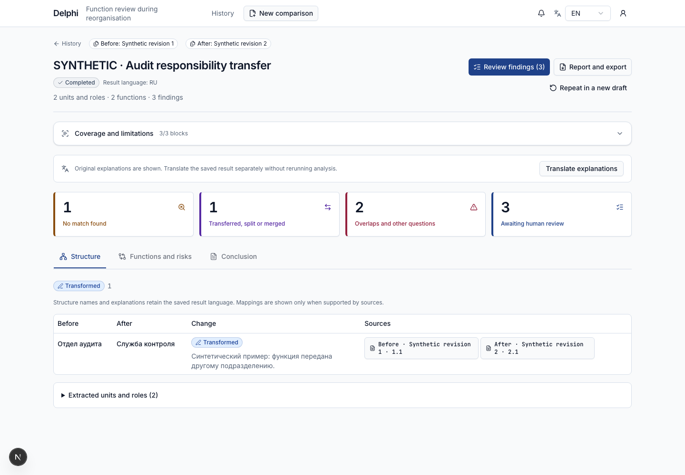

### Analysis · Original source and parent context · 1440 × 1000

The source panel keeps original Russian quotations, parent clauses and neighbouring-block navigation. **Data:** Synthetic API fixture; real frontend and authentication; no live AI. **Test:** passed.

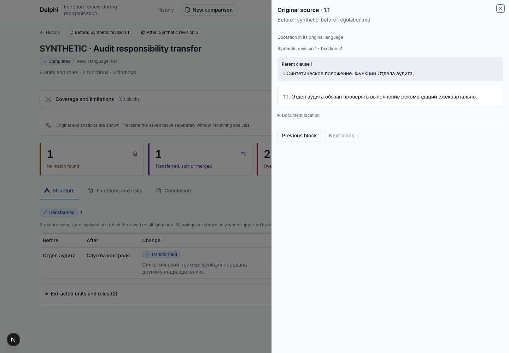

### Analysis · Functions and risks · 1440 × 1000

Searchable findings use shareable URL filters for change type, issues, review status and units. **Data:** Synthetic API fixture; real frontend and authentication; no live AI. **Test:** passed.

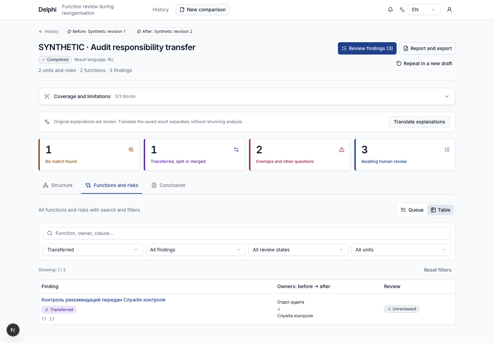

### Analysis · Finding evidence and human review · 1440 × 1000

A deep-linked finding shows original before/after quotations and a separate human-review form. **Data:** Synthetic API fixture; real frontend and authentication; no live AI. **Test:** passed.

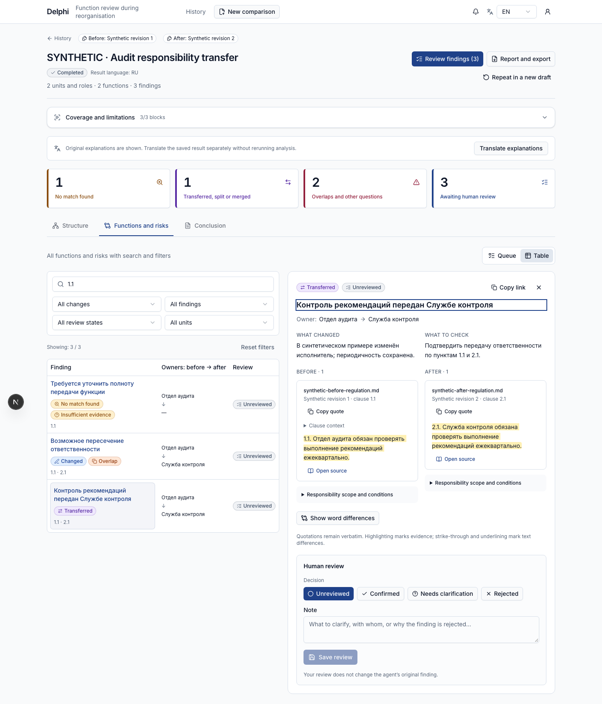

### Analysis · Reviewed conclusion and exports · 1440 × 1000

The report reflects the saved human review and stays available in its original language before translation. **Data:** Synthetic API fixture; real frontend and authentication; no live AI. **Test:** passed.

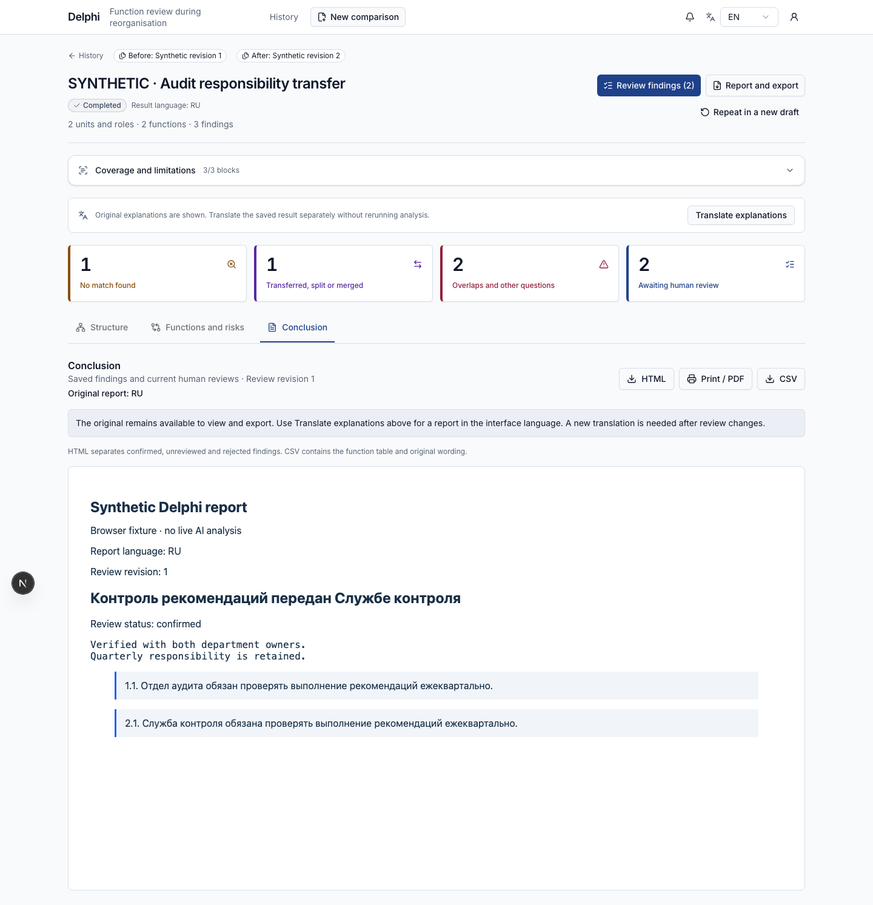

### Analysis · Explicit saved-result translation · 1440 × 1000

Translation is requested explicitly; translated reports preserve original source quotations and review revision. **Data:** Synthetic API fixture; real frontend and authentication; no live AI. **Test:** passed.

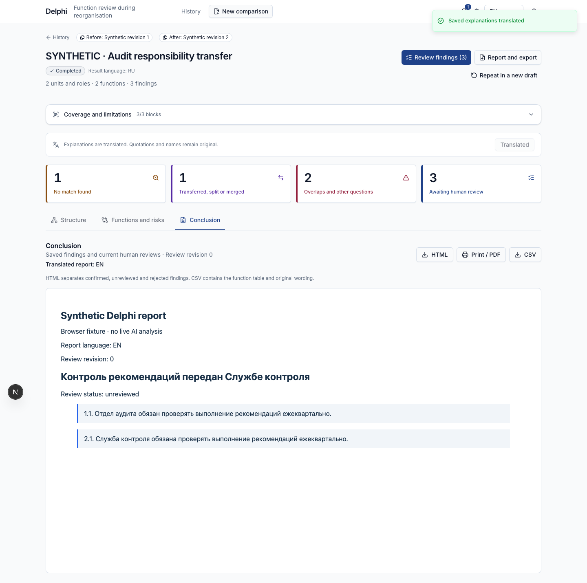

### Analysis · Running · 1440 × 1000

An active run shows its current stage and coverage while polling for completion; unavailable findings are hidden. **Data:** Synthetic API fixture; real frontend and authentication; no live AI. **Test:** passed.

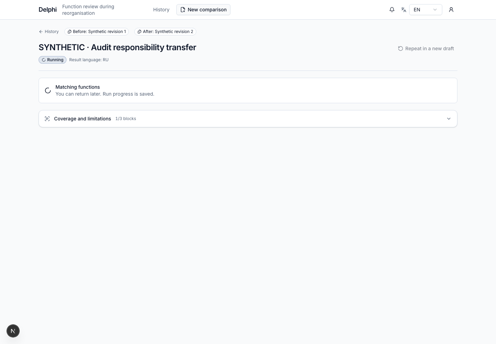

### Analysis · Failed run and coverage · 1440 × 1000

Failure details and incomplete coverage are visible, with a new-draft retry action instead of invented results. **Data:** Synthetic API fixture; real frontend and authentication; no live AI. **Test:** passed.

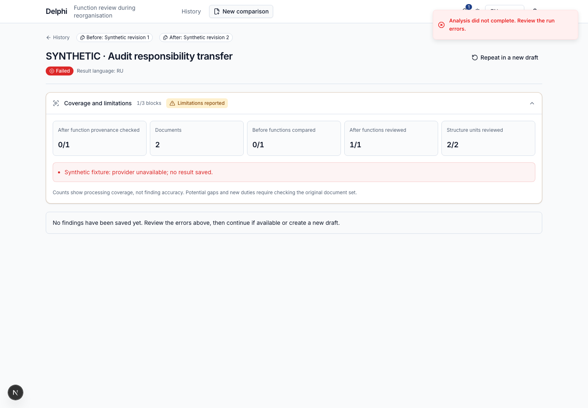

### Analysis · Linked finding outside queue filters · 1440 × 1000

A queue deep link preserves its requested finding and original evidence even when the queue filter excludes it. **Data:** Synthetic API fixture; real frontend and authentication; no live AI. **Test:** passed.

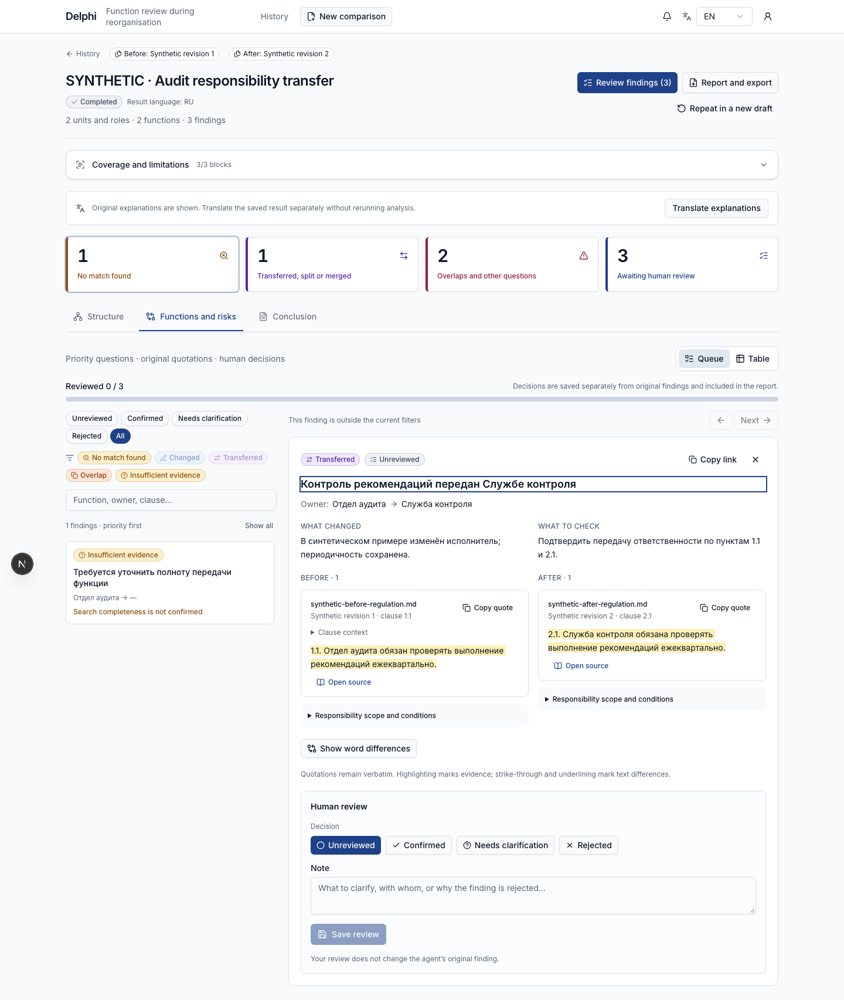

### Mobile history · 390 × 844

The history shell fits a 390-pixel mobile viewport; this navigation check does not validate backend availability or saved history content. **Data:** Real frontend and authentication; live history request. **Test:** passed.

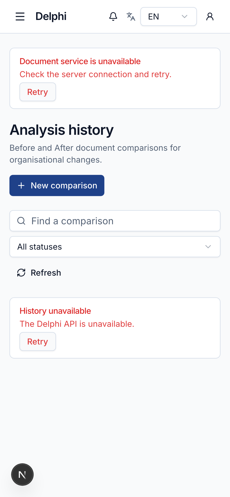

### Mobile navigation · 390 × 844

The side sheet exposes history, new comparison and sign-out on small screens. **Data:** Real frontend navigation and authenticated session. **Test:** passed.

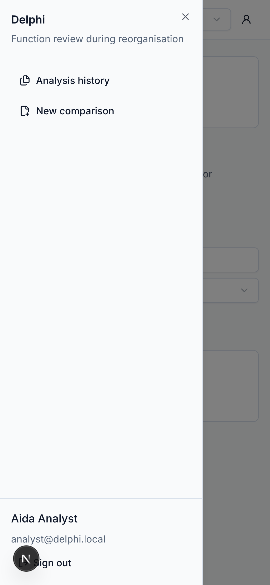

### New comparison — Kazakh mobile UI · 390 × 844

The Kazakh interface persists after reload, including mobile form and navigation labels. **Data:** Real frontend locale persistence. **Test:** passed.

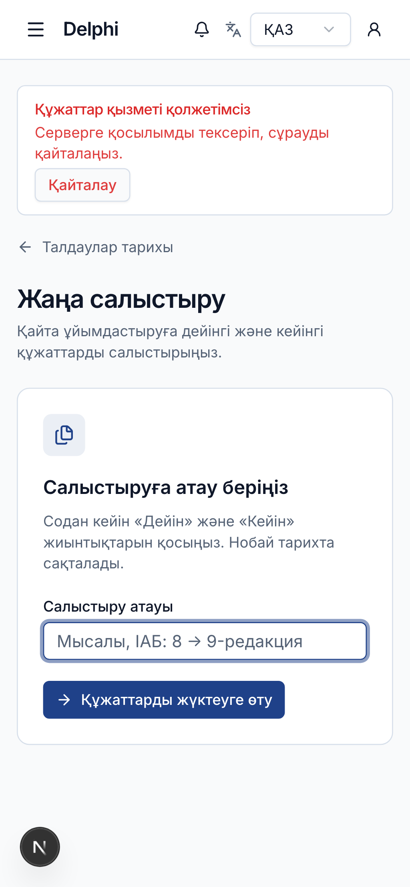

### Mobile analysis · Linked evidence · 390 × 844

A linked finding stays readable on a narrow screen even when the queue filter excludes it; original quotations and human review remain available. **Data:** Synthetic API fixture; real frontend and authentication; no live AI. **Test:** passed.

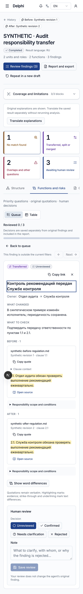

